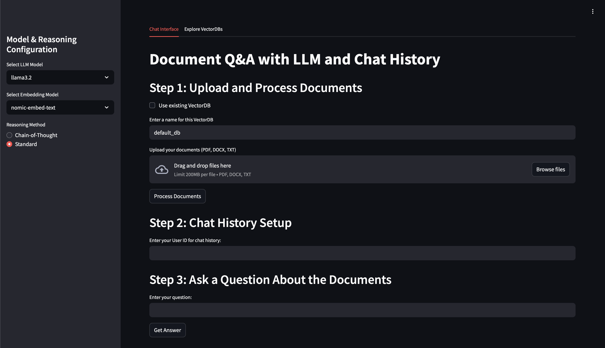

# LocalChatRAG

# Chat App with Document Ingestion, LLM Querying, and Persistent Chat History

This project provides a web-based chat application built with Streamlit that allows users to:
- **Ingest Documents:** Recursively scan a folder (and its subdirectories) for DOCX, PDF, and TXT files.
- **Process and Index:** Load and chunk the documents, then store them in a vector database using embeddings.
- **Query with an LLM:** Use either chain-of-thought (CoT) or normal querying with a toggleable setting.
- **Select Models Dynamically:** Choose which LLM and embedding model to use from the sidebar.
- **Persist Chat History:** Save conversation history using SQLChatMessageHistory, tied to a user ID, with the option to clear history and start a new chat.
- **See Metadata in Output:** Includes elapsed time info.
- **Manage Vector DBs:** View and delete vector DBs from the sidebar interface.
- **Concise Source Attribution:** Outputs unique file names of uploaded files referenced.

## Table of Contents

- [Overview](#overview)
- [Requirements](#requirements)
- [Installation](#installation)
  - [Installing Ollama](#installing-ollama)
  - [Installing Python Packages](#installing-python-packages)
- [Project Structure](#project-structure)
- [Detailed Description](#detailed-description)
  - [Document Ingestion and Processing (`ChatUpload.py`)](#document-ingestion-and-processing-chatuploadpy)
  - [LLM Querying with Chain-of-Thought (`ChatLLM.py`)](#llm-querying-with-chain-of-thought-chatllmpy)
  - [Chat Interface and Persistent History (`ChatUI.py`)](#chat-interface-and-persistent-history-chatuipy)
- [How to Run the App](#how-to-run-the-app)
- [Customization and Troubleshooting](#customization-and-troubleshooting)

## Overview

The chat app allows users to easily upload a folder containing documents, process them into a searchable vector database, and then ask questions using a sophisticated LLM reasoning process. Each conversation is stored in a SQL-backed chat history, making it possible to review past interactions or clear them to start anew.

### Preview



## Requirements

- **Python 3.8+**
- **Ollama** – A tool to run LLMs locally.
- Python packages:
  - `streamlit`
  - `langchain`, `langchain_community`
  - `chromadb`
  - `PyPDF2`, `python-docx`
  - Any additional dependencies required by your selected LLM

## Installation

### Installing Ollama

1. Visit the [Ollama website](https://www.ollama.com) and follow the installation instructions for your operating system.
2. Ensure Ollama is running on your machine, as it is required for LLM interactions.

### Installing Python Packages

It is recommended to use a virtual environment. For example:

```bash
# Create a virtual environment
python -m venv venv

# Activate the virtual environment
# On macOS/Linux:
source venv/bin/activate
# On Windows:
venv\Scripts\activate

# Install required packages
pip install streamlit langchain langchain_community chromadb python-docx PyPDF2
```

## Project Structure

```
.
├── ChatUpload.py     # Handles document loading, chunking, and vector DB creation/update.
├── ChatLLM.py        # Contains the LLM query logic with support for CoT and standard queries.
├── ChatUI.py         # The Streamlit app with sidebar model selectors and query toggles.
└── README.md         # This documentation file.
```

## Detailed Description

### Document Ingestion and Processing (`ChatUpload.py`)

**Purpose**

Scans a specified folder and subdirectories for DOCX, PDF, and TXT files, loads them using format-specific loaders, and extracts metadata (like filenames).

**Key Functions**

- `load_documents(root_folder_path)`: Recursively searches for supported files and loads them.
- `chunk_text(documents, chunk_size=300, chunk_overlap=125)`: Breaks text into manageable chunks for vector DB storage.
- `create_or_update_vector_db(chunks, model_selected_embedding, db_path)`: Stores chunks using embedding model into a vector DB.

---

### LLM Querying (`ChatLLM.py`)

**Purpose**

Generates answers using the selected LLM via:

- `query_llm_cot`: Chain-of-thought style multi-step reasoning.
- `query_llm_norm`: Standard direct question answering.

**Metadata Included**

- Elapsed time  
- Tokens per second  
- Unique file source references (displayed by original filename only)

---

### Chat Interface and Persistent History (`ChatUI.py`)

**Purpose**

Streamlit frontend that allows:

- Folder input or file upload  
- Document processing and DB creation  
- Dynamic selection of LLM and embedding model from the sidebar  
- Toggle between CoT or direct query mode  
- Persistent conversation history (via `SQLChatMessageHistory`)  
- Ability to clear history and start new chats  
- View and delete existing vector DBs in the interface

## How to Run the App

1. Open a Terminal or VS Code Integrated Terminal.
2. Navigate to your project directory:
   ```bash
   cd path/to/your/project
   ```
3. Activate the Virtual Environment:
   ```bash
   # On macOS/Linux:
    source venv/bin/activate
    # On Windows:
    venv\Scripts\activate
   ``` 
4. Run the Streamlit App:
   ```bash
   streamlit run ChatUI.py
   ```
   
   **Optional:** To run the app on a specific host/port (e.g., accessible externally):
   ```bash
   streamlit run ChatUI.py --server.address 0.0.0.0 --server.port 8501
   ```
5. Open your Browser:
   - The terminal will display a local URL (e.g., `http://localhost:8501`). Navigate to this URL to use the app.

## Customization and Troubleshooting

### Model and Embedding Settings

Use the sidebar to choose from installed LLM and embedding models dynamically.

### Vector DB Management

View and delete existing `.db` files from the sidebar interface.

### Chat History

Tied to a unique session ID. Clear history to begin a new conversation.

### Performance Metadata

Display includes total response time and generation rate (tokens/sec).

### Troubleshooting Tips

- Ensure you’re using the latest LangChain versions.
- If a model isn’t loading, confirm it’s installed via Ollama and matches the name used (e.g., `your-embedding-model` and `your-llm-model`).
- Modify the `db_path` for the vector database or change the SQLite connection string in the chat history configuration as needed.
- The app provides an option to clear chat history. Ensure that your version of `SQLChatMessageHistory` (imported from `langchain_community.chat_message_histories`) supports the `clear()` method. If not, refer to the LangChain documentation for guidance.
- For custom swap or memory configurations on Jetson devices, see NVIDIA’s official performance docs.
- If you encounter module import warnings or errors (e.g., deprecation messages), verify that you are using the latest versions of the required packages and refer to the updated LangChain documentation.
